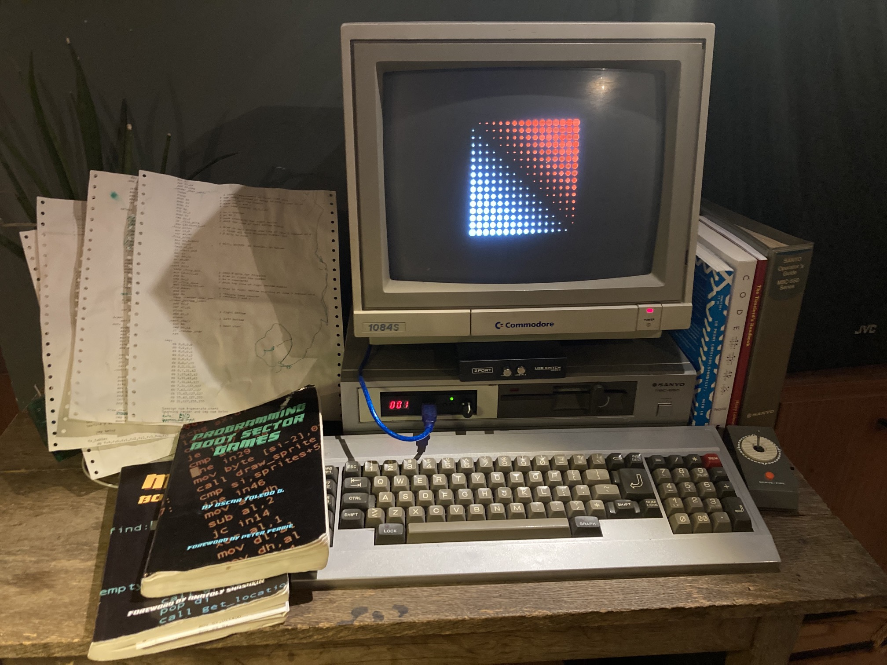

# TIXY.BOOT
tixy.boot by Rick Companje, 2021-2022, MIT licence.
512 bytes bootsector code for Sanyo MBC-550/555 (8088)

A tribute to Martin Kleppe's beautiful https://tixy.land as well as a tribute to the Sanyo MBC-550/555 PC (1983) which 'forced' me to be creative with code since 1994.

**UPDATE** in 2025 during Outline 2025 DemoParty in The Netherlands. The assembly code was reduced from 512 bytes to 256 bytes! And won the 3rd price in the 256b Oldskool Intro contest.

## About the Sanyo
The Sanyo MBC-55x has a very limited ROM BIOS. After some hardware setup by the ROM BIOS a RAM BIOS loaded from floppy takes over. This means that we don't have any BIOS functions when running our own code from the bootsector. 

The Sanyo has no display mode 13 (not even with the original RAM BIOS). It uses a 6845 video chip with three bitmapped graphics planes and is organized as 50 rows by 72 (or 80) columns. One column consists of 4 bytes. Then the next column starts. After 72 columns a new row starts. A bitmap of 16x8 pixels is made up of 2 columns on row 1 and 2 columns on row 2.

To run this code write the compiled code to the bootsector of a Sanyo MBC-55x floppy or use an emulator like MAME.



## FILE_ID.DIZ
```
___________________________________________
 ▗▄▄▖ ▗▄▖ ▗▖  ▗▖▗▖  ▗▖▗▄▖ ▗▖  ▗▖ ▗▄▖ ▗▖  ▗▖2
▐▌   ▐▌ ▐▌▐▛▚▖▐▌ ▝▚▞▘▐▌ ▐▌▐▛▚▞▜▌▐▌ ▐▌▐▛▚▖▐▌
 ▝▀▚▖▐▛▀▜▌▐▌ ▝▜▌  ▐▌ ▐▌ ▐▌▐▌  ▐▌▐▛▀▜▌▐▌ ▝▜▌ 
▗▄▄▞▘▐▌ ▐▌▐▌  ▐▌  ▐▌ ▝▚▄▞▘▐▌  ▐▌▐▌ ▐▌▐▌  ▐▌
───────────────p r e s e n t s─────────────
_256_bytes_oLdSkool_iNtRo_for OUTLINE 2025
TIXY in 256 bytes  Sanyo MBC-555 bootsector
grTz 2 aem1k,nanochess,superogue,zeroZshadow
───────────────────────────────────────────

I love my Sanyo MBC-555 computer from 1983. 
It's a NOT-so-IBM-compatible 8088 PC. It has
no real ROM-BIOS and a very inconvenient 
VRAM mapping. It shipped with MS-DOS 1.25,
Sanyo BASIC and DEBUG.COM. That got me into
8088 assembly programming back in the days (1993).
My version of DEBUG had no 'assemble'-command,
so I had to enter my progams as HEX values.

My contrib to Outline 2025 is a 256 byte
Oldskool Intro inspired by tixy.land by aem1k.
It runs in the bootsector of the Sanyo
without BIOS or OS.

During the party I had to reduce my code 
from 512 to 256 to join the compo. 
Thanks for all the help and fun!

Thank you:
- aem1k to come up with https://tixy.land!
- nanochess for writing 2 great books about bootsector games
- superogue and others at Outline 2025 for the warm welcome to the DemoScene
- zeroZshadow for diving really into the code with me and implementing great improvements

Best wishes,
Sanyoman2 aka RickyboyII
```

# 512 bytes version vs 256 bytes version
In the 256 bytes version there's no sine function anymore. Also no sqrt function.
But maybe, once... we can add it again or come up with a replacement (superogue had some tips I remember)

# Old code snippets.
Instead have a look at the See [tixyboot.asm](tixyboot.asm) for the full source code. file because multiple things changed. al is now between 0..31 instead of -15..15 for example.

```
t = time  0..255
i = index 0..255
x = x-pos 0..15
y = y-pos 0..15

result: 
  al -15..15 (size and color)
  al<0 red, al>0 white
```


**Note: this code is written for a Sanyo MBC-550/555 PC! It won't work on a regular IBM-compatible-PC**

See [tixyboot.asm](tixyboot.asm) for the full source code.

```asm
; ...

; using dx and bx registers as t,i,x,y variables
%define t dh
%define i dl
%define x bh
%define y bl

jmp setup

fx_table:      ; the 'effects' table: 8 bytes, overwriting the 'Sanyo1.2' tag
    db fx0,fx1,fx2,fx3,fx4,fx5,fx6,fx7 

; ...

fx0: ; x
    mov al,x
    ret

fx1: ; y-7
    mov al,y
    sub al,7
    ret

fx2: ; y+t
    mov al,y
    add al,t
    ret

fx3: ; y-t
    mov al,y
    sub al,x
    ret

fx4: ; sin(x+y+t)
    mov al,x
    add al,y
    add al,t
    call sin
    ret

fx5: ; bitmap_data[i+t]
    push bx
    mov al,i
    add al,t
    mov bx,bitmap_data
    xlat
    pop bx
    ret

fx6: ; -8*(y-x)+t
    mov cl,-8
    mov al,y
    sub al,x
    mul cl
    call limit
    add al,t
    ret

fx7: ; sin(sqrt(x^2+y^2))-t)
    mov al,i   ; isqrt_table[i] = sqrt(x^2+y^2)
    push bx
    mov bx,isqrt_table
    xlat
    pop bx
    sub al,t
    call sin
    ret

; ...

setup:
; ...

draw:
; ...
```

See [tixyboot.asm](tixyboot.asm) for the full source code.
